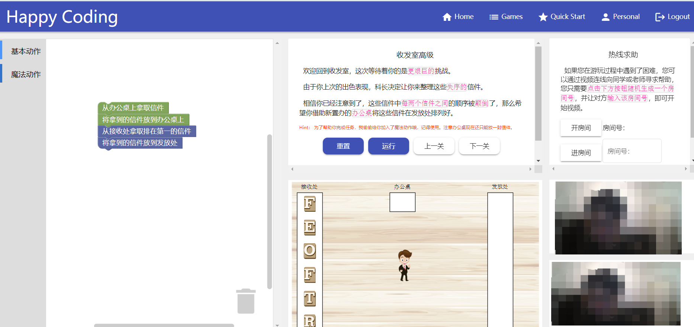

# 基于 Scratch Blockly的计算思维可视化学习平台

## 1、开发任务概述

### 1.1 开发目标

在这个选题中，你需要实现一个基于 Scratch Blockly 的计算思维可视化学习平台，为初入编程大门的人提供一个培养计算思维的办法。

- 通过对Scratch Blocks以及其他Web领域前沿技术的体验与研究，了解行业在可视化、前端存储等领域的发展方向，提高自身技术水平；
- 在线编程教育是未来必然的一个发展趋势。本文以可视化为核心，计算思维为主题构建学习平台，为在线编程教育提供一个发展思路；
- 计算思维是运用计算机科学的基础概念进行问题求解、系统设计、以及人类行为理解等涵盖计算机科学之广度的一系列思维活动。具体一点包括递归、循环、抽象和分解等。

### 1.2 条件和约束

#### 1.2.1 前提约束

**不得抄袭，被发现后果自负。**

允许借鉴与学习开源项目与材料。

#### 1.2.2 依赖条件

能够熟练编写HTML、CSS、JavaScript，掌握JSON和RESTful的基础应用，对JavaEE基础架构、Spring Boot、Blockly二次开发、MyBatis、数据库设计有一定的认识。并对课程中涉及的其他Web技术有一定的基础和了解。

技术范围：

* Web基础课程的知识（HTML，CSS，JavaScript），AJAX技术。
* 前端采用Angular组件开发
* Blockly二次开发
* 后端采用Spring Boot框架，MyBatis作数据库持久化层，数据库不限制，MySQL、MongoDB或者图数据库如Neo4j
* 前端与后端的程序均部署在云服务器上，在线上环境直接演示。
* WebRTC

## 2. 系统基本功能与流程

### 2.1 功能要求

#### 2.1.1 基本功能

- 学生前台页面
    - 用户登录、注册；个人信息、操作记录、场景历史等
    - 选择相应的场景去学习计算思维
- 用户后台页面
    - 记录用户信息和学习场景的完成情况，可以结合个人设计丰富内容。
- 编程可视化
    - 利用blockly二次开发构建通用的学习模块，将编程从代码的打字输入编程转化为可视化的模块拖拽，不仅免去学习语法的前置门槛，还能增加编程趣味性，提高用户的学习积极性。
- 设计学习场景
    - 分析并设计比较适合可视化学习的计算思维，归纳总结其特点，并为之设计一个或多个具体的应用场景供用户学习。每个场景可以分为多个步骤，用户通过完成每一步的任务，逐渐加深对该计算思维的理解，最后达到掌握计算思维的目的；
    - 学习场景动画演示。
- 历史记录
    - 考虑到时间原因或者是用户被某个场景的任务卡住，平台应提供历史记录功能，让用户在下一次进入该场景时，可以从前一次未完成的地方继续学习，而不是再一次从头开始，重复已完成的工作。
- 系统部署在云服务器上，提供可以访问的公网地址。

#### 2.1.2 进阶功能

- 协同学习。当用户卡关时，可以选择把自己的房间id告诉朋友或老师，让其加入房间。加入房间后，支持视频通讯，辅导者演示等功能。辅导者演示的时候，其演示步骤要与被辅导者共享。可以选择TurnServer或者coturn实现WebRTC，推荐coturn。	
- 结合Web 3D展示，引入 Three.js 做生成代码的图，计算思维的代码生成与Three.js结合 

### 2.2 性能需求

除了功能需求外，学习平台还在以下几个方面有一定的需求：

* 易实用性：由于针对的是初入编程大门，对编程仍一知半解的青少年，平台需要通过细微的提示和简单的操作让用户简单、快速地上手，减少学习成本和受挫感。
* 稳定性：平台应在某些服务出现问题后只是功能缺失，本身仍能稳定运行。
* 可维护性：由于每种场景都会涉及许多自定义模块，因此模块的管理会是平台维护的一个难点。平台设计时需要考虑模块的抽象与服用，提升平台的可维护性。

## 3.系统说明

### 3.1 建议

- 采用前后端分离架构；
- 前端框架建议采用 Angular；
- 后端框架建议采用 SpringBoot；
- Scratch Blockly 前端。
- 使用coturn实现p2p WebRTC

### 3.2 参考资料

- Google Blockly 资料 : https://developers.google.cn/blockly/
- Scratch Blocks 官方文档 : https://scratch.mit.edu/developers
- Sphere Engine 官方文档 : https://developer.sphere-engine.com/api/compilers?version=3
- Web Storage W3C 标准文档 : https://www.w3.org/TR/webstorage/

### 3.3 参考截图

给出部分关键功能截图为同学们提供灵感。动手开发时不要求与demo完全相同。

##### **主要页面**

在这个页面中，用户可以拖拽blocks，完成给定的场景的任务。用户点击运行后，场景中的人物可以模拟用户的动作并演示，无论失败还是成功都要给出对应提示。最右侧的协同学习是进阶功能，可以要求老师或朋友辅导自己。协同包括视频通讯和操作演示，如何开启协同可以自定义。

## 4. 评分细则 

### 4.1 分数组成

- 基本功能分:即完成系统基本内容与流程，满分 100 分。 
- 进阶任务分:包括但不限于更精致的设计、场景，更好的开发部署流程、计算思维等。最多 30 分。 
- 个人工作分:根据小组分工及个人完成工作量得分。每组组员该项分数总和 30 分，根据贡献比例分摊。

个人最终得分 = 基本功能分 + 进阶任务分 + 个人工作分，值域为 [0, 160]。 

### 4.2 评分点

|功能项 | 得分项 | 最高分数|
| ------ | ------ | ------ |
|UI和交互（10分） | 界面美观 | 5 |
| | 交互体验流畅，菜单和返回正常使用 | 5 |
| 基本流程（15分） |注册和登录页面| 5 |
|| 新手导航 |5|
||用户后台页面 |5|
|可视化场景（45分） |正确显示一个可交互的 Blockly 场景 |10|
| |场景的创意、功能的完成度和交互的丰富程度| 20 |
||正确更新代码提交通过后的变化、生成效果| 10|
||历史记录 |5|
|工程能力（20分）| 文档（详实准确） |5|
|| 系统架构 |10|
||代码风格（代码整洁、注释完整、计算思维等）| 5|
|项目部署（10分）|将服务器部署到公有云上 |5|
||使用Docker部署 |5|
|进阶功能 |协同学习| 20 |
| |结合Web3D展示场景| 15 |
||其他合理亮眼的附加功能 |15|

### 4.3 评分点说明

1. 每一项的分数取决于该项功能的完成度。完成度和可用性越好，分数越高。 

2. 项目完整度和易用性评价标准:

- A. 功能残缺，不能完整运行，有明显bug

- B. 完成规定的用户功能和操作，无明显瑕疵

- C. 界面舒适，操作合理，响应迅速，鲁棒性强

  A、B、C 分别对应 分数的0 - 30% ，30% - 70% 分，70% - 100% 分。

3. 附加功能必须在文档中明确写出，概述该功能并描述实现原理。 

4. 项目设计文档需要至少包含:
    - 项目组织以及其中每个文件的说明。
    - 关键功能实现的细节。
    - 服务器部署配置的详细介绍。

5. 团队分工文档需要至少包含: 
    - 团队成员、分工、具体完成工作，列出每个人的贡献比例。
    - 其他你们想说明的问题。 
    
## 5. 提交

1. 提交物包含以下三项:
    - **源代码**：推荐使用 Git 进行协作，提交到 GitHub 等 Git 托管平台上。 
    - **文档**：推荐使用 Markdown 编写项目文档，与源代码一同提交到 Git 托管平台上。 
    - **可供访问的公网地址**，以及系统的操作说明(玩法)。
2. 提交物需要压缩打包提交到 FTP 上，文件名中请包含小队所有成员的姓名与学号。 

3. 友情提示：请尽早开工，本学期只有一个 Project，临时赶工很有可能完不成。
